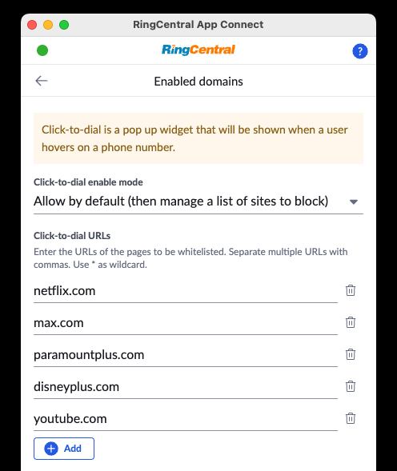

# Click-to-dial

When using your CRM, all phone numbers in your CRM will become clickable, allowing you to easily initiate a call with that phone number, or send an SMS message to that phone number. This helps users more quickly and easily engage with contacts, leads, candidates and people whom your CRM tracks.

<figure markdown>
  { .mw-450 }
  <figcaption>Click-to-dial hovercard for easy calling</figcaption>
</figure>

## Enabling click-to-dial for internal phone numbers

Internal phone numbers, e.g. a plain extension, are also supported for click-to-dial so that you can easily call a co-worker -- provided that the phone number is in the following format `{mainNumber}#{extensionNumber}`. For example, `+12223334444#438`.

## Turning on/off click-to-dial

Users can manage which screens, websites, and URLs that click-to-dial is enabled for under Settings > General > Enabled domains. Here users can select one of the following options:

* Disabled
* Enable for connected CRM only
* Block by default (then manage a list of sites to allow)
* Allow by default (then manage a list of sites to block)

If either "Block by default" or "Allow by default" are selected, users can then manage a list of URLs for which click-to-dial will be blocked or allowed respectively. 

<figure markdown>
  { .mw-400 }
  <figcaption>Turn click-to-dial on and off for specific URLs</figcaption>
</figure>

