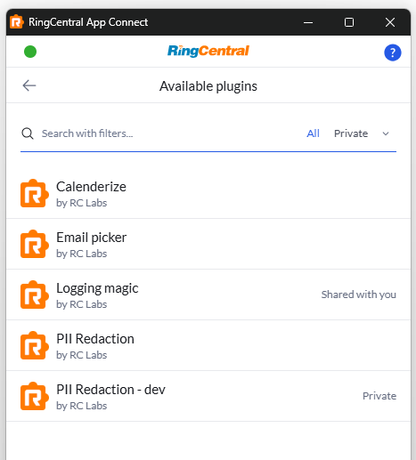
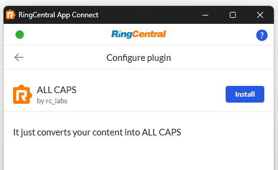

# Plugins

Plugins let App Connect do more than connect RingCentral to a CRM. A plugin is an optional add-on that runs during logging and can either change the log data before it is saved, or do extra work after the log is created.

Plugins are created by developers in the App Connect Developer Console, installed by admins in App Connect, and configured by end users.

## What plugins can do

In the current implementation, plugins can:

* Run for up to 3 log type cases: `call`, `sms`, and `fax`
* Process data synchronously before App Connect saves the log OR run asynchronously in the background after logging starts

Plugins are different from [connectors](../developers/index.md). A connector integrates App Connect with an entire CRM. A plugin extends what happens around logging inside an existing connector.

## For admins

Admins are responsible for deciding which plugins are available to users in their account.

### Browse available plugins

The Admin area includes a Plugins section where admins can review:

* **Public** plugins, which are published broadly
* **Shared with you** plugins, which have been shared with your RingCentral account
* **Private** plugins, which are visible only within your account

Admins can explore the plugin marketplace before deciding what to install.

### Install a plugin

To install a plugin:

1. Open the **Admin** tab in App Connect.
2. Open **Plugins** and click **Explore**.
3. Review the plugin details page.
4. Click **Install**.

When a plugin is installed, it becomes part of the account configuration for the connected CRM. Users can then see the plugin in their installed plugins list.

### Remove a plugin

On the same plugin details page, admins can click **Uninstall** to remove the plugin from the account.

Removing a plugin stops it from executing in workflow and appearing in users' installed plugin list.

### Manage plugin settings for users

!!!info "Some plugins may not have anything to configure. If that's the case, you won't see anything in config page."

Installed plugins can also expose admin-managed settings. App Connect provides a dedicated **Managed settings > Plugins** area where admins can review each installed plugin and define default values for plugin fields.

Admins can also control whether each field remains customizable by end users.

This is useful when a plugin needs:

* A shared default value for the whole account
* Account-level setup before users start using it

## For users

Users do not install or remove plugins. Instead, users work with the plugins that an admin has already installed for the account.

### Open the installed plugins list

On **User settings** page, go to **Plugins**. When one or more plugins are installed for your account, App Connect shows an installed plugins list on the user side. From there, you can open each plugin's configuration page.

### Configure a plugin

Each installed plugin can expose its own configuration form. The fields come from the plugin profile created by the developer.

After making changes, click **Save** to update your personal plugin settings.

If an admin locked a field, you may be able to view it without changing it.

### Connect or disconnect a third-party account

Some plugins show a **Connect** button on the configuration page. These plugins require a separate login to a third-party service.

When the plugin supports OAuth:

* **Connect** starts the plugin's sign-in flow
* **Logout** disconnects the third-party account from that plugin

## Runtime behavior

### Supported log types

A plugin can declare one or more supported log types:

* `call`
* `sms`
* `fax`

App Connect only runs a plugin for the log types the plugin declares.

### Sync vs async processing

Plugins support two execution modes:

* **Sync**: the plugin runs before the CRM log is saved and can return updated log data
* **Async**: the plugin runs after App Connect saves the log, so logging does not wait for the plugin to finish. For call logs, an async plugin can report back later and append a note to the Agent notes field.
