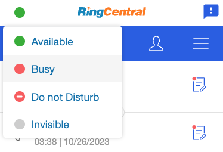

# Managing presence and call queue status

App Connect’s embedded phone makes it easy to set and sync your presence and status across the network. Any changes to your status—whether made directly in the dialer or through other mechanisms—are automatically reflected in the embedded dialer.

## Changing your presence status

There are two ways to change your presence:

1. **Using the Embedded Dialer**
    Click the presence indicator in the upper-left corner of the embedded dialer.
    
    

2. **Via the Settings Page**
    Navigate to the Settings page under the More menu and update your presence status from there.
	
    

## Call queue presence management

If you're a member of a call queue, you can manage your call queue presence through the Status Settings section in App Connect.

### Accept calls from call queues

Toggle this setting to control whether you receive calls from any call queue. When disabled, you won't receive call queue calls.
   

### Manage call queue presence

Use this option to opt out of specific call queues, allowing finer control over which queues you're available for.
   

!!! note "To change call queue presence, you must have the necessary permissions, and the call queue must be configured to allow member presence updates in the RingCentral admin portal."
