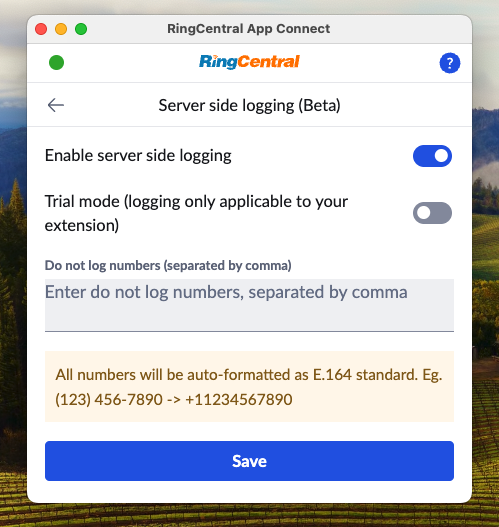
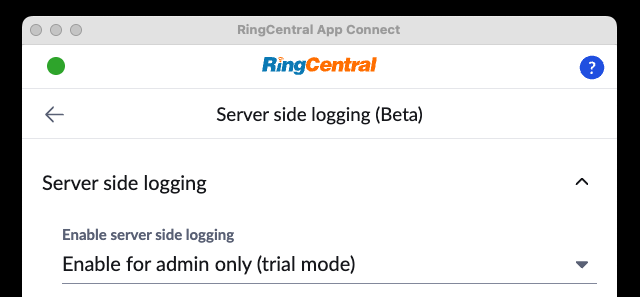

# Server-side call logging

!!! warning "Server-side call logging is currently in beta"
    This feature is currently in beta and may exhibit some issues. We encourage users to try the feature out in order to help us refine the feature. Known issues and limitations:
    
	* Can only be enabled for entire organization (no partial enablement)
	* Limited UI for determining which phone number(s) to block from logging
	* May briefly result in double-logging when initially turned on
	
!!! info "Server-side call logging may become a premium feature"
    The costs associated with operating a server-side call logging service may require us to charge for this feature in the future. 
	
## Seamless Call Logging with App Connect

Out of the box, App Connect enables users to log calls directly from the App Connect client (Chrome extension). We call this "client-side logging." App Connect can even be configured to log calls automatically for added convenience. However, relying solely on client-side logging comes with certain limitations:

* **Delayed Logging**: Not all calls may be logged in real-time.

* **Limited Coverage**: Only calls from users who have the App Connect extension installed will be logged.

## Server-Side Call Logging: A Reliable Solution

Server-side call logging eliminates these challenges. Operating at the organizational level, it logs calls for all users—whether or not they have App Connect installed. Additionally, it captures call data immediately after each call ends, ensuring comprehensive, timely, and reliable logging across your entire organization.

!!! tip "We still recommend all users install the App Connect client."
    Installing the App Connect client ensures that all users have the ability to quickly resolve issues preventing calls from being logged. For example, when zero, or more than one contact is matched to a phone number. 

## Enabling server-side call logging

Currently the server-side call logging feature is in beta, and can be enabled from the Admin settings screen as shown below. 

Under **Enable server side logging**, select "Enable for account", and then save to enable this feature.

!!! tip "To make sure server-side logging is functioning properly, it is best for the admin to maintain an active session in the CRM to keep the CRM connected and authorized in App Connect."

#### Trial-mode

If you are unsure of turning on server-side call logging across your entire account, the admin in your account can enable server-side call logging for their extension exclusively. It is the intent of this feature to allow admins to try the feature out for a period of time before enabling it for other users. 

Under **Enable server side logging**, select "Enable for admin only (trial mode)", and save.

## Configuring server-side call logging

From the Server side logging page, an admin can enable call logging for their entire organization. Once enabled, automatic logging from the client will be disabled across your entire organization. Users will still be able to log calls manually, or edit call log entries made by the server-side call logging service. 

### Activity record owner

When App Connect's server-side logging service is enabled, the service will use the RingCentral admin's credentials who initialy enabled the feature to subscribe all new call events across the entire organization, as well as to save activity records in CRM. As a result, the owner of all activity records will be the admin. 

This is sometimes desirable, but other's may prefer for audit trail purposes to have the owner be the person who conducted the phone call, as that is deemed more accurate. 

To override this behavior, set **Activity record owner** to "Agent/user (if possible)," This will assign the record owner to the user when following conditions are true:

1. The user has previously connected to the CRM via App Connect. 
2. The user has access permissions in the CRM that allow them to create activity records.

If none of those conditions are true, the activity record owner will default to the admin that setup server side logging.

To always assign ownership of the activity record to the admin, set **Activity record owner** to `Admin`. 

### Blocking some phones from being logged

From the "Server-side call logging" page, you can specify a list of phone numbers and/or extensions for which you do not wish to log calls. Phone numbers must be represented usig the E.164 format, e.g. `+15105551234`. Multiple phone numbers and extension numbers can be specified provided they are separated by a `,` comma. 

!!! info "Special considerations when using server-side call logging"
    * Calls to the main company number that are dropped before being redirected to an extension will not be logged.
    * When a call is made to the main company number and redirected to a user, the call duration recorded may appear longer than the actual time spent by the user. This is because the recorded duration includes the time taken for the call to be redirected.
    * Logs created through server-side logging use admin credentials, so extension users may not be able to edit them. Normal users require the appropriate CRM permissions to update log data.

### Use admin settings

Server side logging uses some admin settings to automate the logging process. Settings are cached and refreshed once every hour. If you want to change setting values and have them reflected immediately in the logging process, please go to server side logging page and save it again so that it will be re-subscribed with new setting values.  
