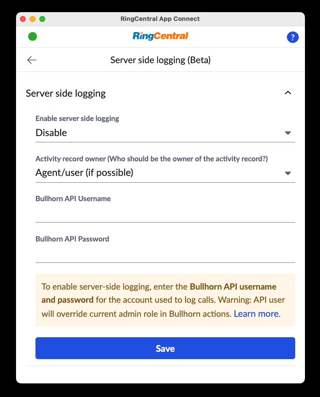

# Server-side call logging

!!! warning "Server-side call logging is currently in beta"
    This feature is currently in beta and may exhibit some issues. We encourage users to try the feature out in order to help us refine the feature. Known issues and limitations:
    
	* Can only be enabled for entire organization (no partial enablement)
	* Limited UI for determining which phone number(s) to block from logging
	* May briefly result in double-logging when initially turned on
	
!!! warning "Call logging VS call dispositioning"
    Server-side call logging only supports call logging NOT call dispositioning. Call logging is to sync call metadata onto target platform, whereas call dispositioning is to modify/attach information from user input (including associating call logs with other entities from the target platform).
    
!!! info "Server-side call logging may become a premium feature"
    The costs associated with operating a server-side call logging service may require us to charge for this feature in the future. 
	
## Seamless Call Logging with App Connect

Out of the box, App Connect enables users to log calls directly from the App Connect client (Chrome extension). We call this "client-side logging." App Connect can even be configured to log calls automatically for added convenience. However, relying solely on client-side logging comes with certain limitations:

* **Delayed Logging**: Not all calls may be logged in real-time.

* **Limited Coverage**: Only calls from users who have the App Connect extension installed will be logged.

## Server-Side Call Logging: A Reliable Solution

Server-side call logging eliminates these challenges. Operating at the organizational level, it logs calls for all users—whether or not they have App Connect installed. Additionally, it captures call data immediately after each call ends, ensuring comprehensive, timely, and reliable logging across your entire organization.

!!! tip "We still recommend all users install the App Connect client."
    Installing the App Connect client ensures that all users have the ability to quickly resolve issues preventing calls from being logged. For example, when zero, or more than one contact is matched to a phone number. 

## Enabling server-side call logging

Currently the server-side call logging feature is in beta, and can be enabled from the Admin settings screen as shown below. 

<figure markdown>
  { .mw-400 }
  <figcaption>App Connect's server-side call logging settings as seen by an admin. Your available settings depends upon the CRM you are connected to (Bullhorn shown above).</figcaption>
</figure>

Under **Enable server side logging**, select "Enable for account", and then save to enable this feature.

!!! tip "To make sure server-side logging is functioning properly, it is best for the admin to maintain an active session in the CRM to keep the CRM connected and authorized in App Connect."

#### Trial-mode

If you are unsure of turning on server-side call logging across your entire account, the admin in your account can enable server-side call logging for their extension exclusively. It is the intent of this feature to allow admins to try the feature out for a period of time before enabling it for other users. 

<figure markdown>
  
  <figcaption>App Connect setup to enable server-side call logging in trial mode</figcaption>
</figure>

Under **Enable server side logging**, select "Enable for admin only (trial mode)", and save.

## Configuring server-side call logging

From the Server side logging page, an admin can enable call logging for their entire organization. Once enabled, automatic logging from the client will be disabled across your entire organization. Users will still be able to log calls manually, or edit call log entries made by the server-side call logging service. 

### Activity record owner

When App Connect's server-side logging service is enabled, the service will use the RingCentral admin's credentials who initially enabled the feature to subscribe to all new call events across the entire organization, as well as to save activity records in the connected CRM. As a result, the default behavior will result in the admin being the owner of all activity records it creates.

This is sometimes desirable, but other's may prefer for audit trail purposes to have the activity record's owner accurately reflect the person who conducted the phone call.

To override this behavior, set **Activity record owner** to "Agent/user (if possible)." This will instruct App Connect to attempt to assign ownership of the activity record based on whether it can find a corresponding user in the CRM based on their respective email addresses in the two systems. Any user that cannot be mapped automatically, can be mapped manually by an admin using the "User mapping" setting.

<figure markdown>
  { .mw-500 }
  <figcaption>App Connect's user mapping function used by admins to ensure activity records are attributed properly.</figcaption>
</figure>

If attempts to determine the correct owner of the note fail, the activity record owner will default to the admin that setup server side logging.

To always assign ownership of the activity record to the admin, set **Activity record owner** to `Admin`. 

<figure markdown>
  
  <figcaption>Server-side call logging setup to assign all activity records to the admin.</figcaption>
</figure>

### Blocking some phones from being logged

From the "Server-side call logging" page, you can specify a list of phone numbers and/or extensions for which you do not wish to log calls. Phone numbers must be represented usig the E.164 format, e.g. `+15105551234`. Multiple phone numbers and extension numbers can be specified provided they are separated by a `,` comma. 

<figure markdown>
  
  <figcaption>Server-side call logging can be setup to NOT log calls made to some numbers.</figcaption>
</figure>

!!! info "Special considerations when using server-side call logging"
    * Calls to the main company number that are dropped before being redirected to an extension will not be logged.
    * When a call is made to the main company number and redirected to a user, the call duration recorded may appear longer than the actual time spent by the user. This is because the recorded duration includes the time taken for the call to be redirected.
    * Logs created through server-side logging use admin credentials, so extension users may not be able to edit them. Normal users require the appropriate CRM permissions to update log data.

### Use admin settings

Server side logging uses some admin settings to automate the logging process. Settings are cached and refreshed once every hour. If you want to change setting values and have them reflected immediately in the logging process, please go to server side logging page and save it again so that it will be re-subscribed with new setting values.  

### When client side extension is in-use

With Server side logging turned ON, and meanwhile using client side extension could be a tricky case.

#### Avoid double logging

Server side logging has quick reactions, meaning it'd be the first to log a call if call events come to server side logging service and your Chrome extension at nearly the same time.

To avoid double logging from server side logging and client side extension, the extension will check if call log already exists. If yes, it'll pop up log edit form instead.

#### Agent notes

Server side logging firstly creates call logs with a pending message. Then, further information e.g. call result, call recording, agent notes will be updated later. 
