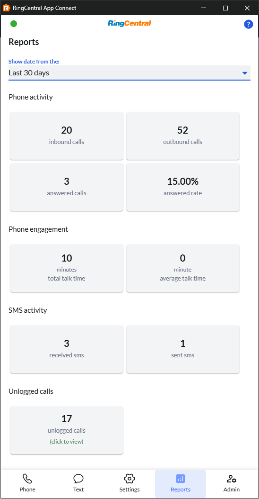

# User Report

The User Report feature provides valuable insights into your calling and messaging activity, helping you track your communication patterns and productivity within App Connect.

## Accessing the User Report

The User Report is located in the **User Report tab** within the App Connect interface. This dedicated tab gives you easy access to your personal communication statistics and activity data.

## Current Features

### Agent-Level Call Statistics

The User Report currently provides **basic agent-level call statistics**, including:

- **Call Activity**: View calls made and received within a selected date range
- **SMS Messages**: Track SMS messages sent within your chosen time period
- **Date Range Selection**: Customize the reporting period to analyze specific timeframes

!!! tip "Stay tuned for updates"
    As we continue to enhance the User Report feature with organization-level statistics, you'll gain even more powerful insights into your team's overall communication performance.