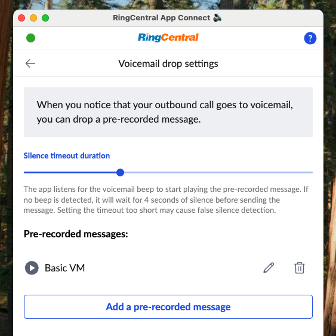
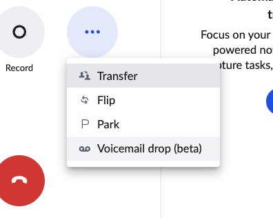

# Voicemail drop

<!-- md:version 2.0 -->

Voicemail drop is a powerful feature in App Connect designed to significantly **increase outbound call efficiency** by automating the process of leaving voicemail messages.

## Key Benefits

This feature is designed to address common pain points in high-volume calling, providing three core advantages:

* **Time Savings:** Automatically drop pre-recorded messages, saving agents time they would otherwise spend repeating the same voicemail.
* **Consistency & Quality:** Ensure every message is **consistent, on-message, and perfectly delivered**, as they are pre-recorded and polished.
* **Delegated Creation:** Allow supervisors or marketing teams to **create and upload voicemail messages** on behalf of agents, ensuring brand alignment.

## Setting up voicemail drop
	
Before you can use the Voicemail Drop feature in a call, you must upload and label your pre-recorded messages.
	
1. Go to **Settings** > **Phone**.
2. Navigate to **Voicemail drop settings**.
3. Click **"Add a pre-recorded message"**.
   
4. **Upload** an MP3 or WAV file containing your voicemail message.
   
5. Provide a clear **label** for the message (e.g., "Initial Prospecting Voicemail" or "Follow-upCall Voicemail"). This label is what you will select during a call.

## Using voicemail drop

1. **During an Outbound Call:** The agent initiates an outbound call.
2. **Detecting Voicemail:** When the agent recognizes they have reached the recipient's voicemail system (e.g., they hear the prompt or greeting), they do **not** hang up.
3. **Initiate Drop:** The agent clicks the **"Drop Voicemail"** button within the App Connect interface.
   
4. **Select Message:** The agent selects the desired pre-uploaded voicemail message from the list.
   
5. **AI Transfer:** The active phone call is immediately **transferred to an AI agent**.
6. **Smart Delivery:** The AI agent listens intelligently for the **voicemail beep**.
7. **Message Dropped:** At the appointed time (after the beep), the selected voicemail message is **played and left** in the recipient's voicemail inbox.
8. **Agent is Free:** The agent is immediately free to move on to the next call, while the AI handles the message drop.
	
